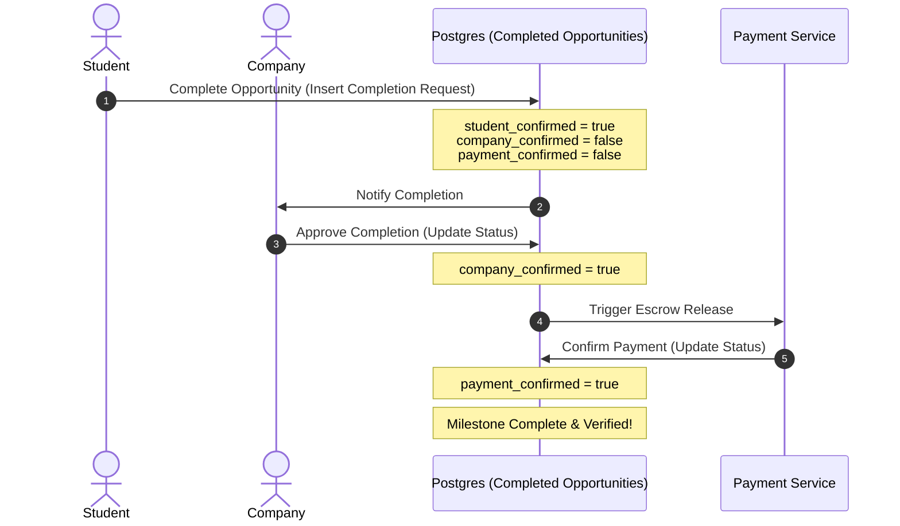

# Core Features Breakdown

This document details the main functional modules of **Sha8lny**, focusing on technical implementation details, workflows, and database entities that power them.

---

## 🤝 1. Multi-Party Completion Handshake (Escrow-style Verification)

To verify internship completions and secure freelance payment settlements, the platform utilizes a secure three-way handshake model. Instead of relying on a single participant's word, completion statuses are validated across multiple entities.



### Technical Workflow
1. **Submission**: The student completes assigned modules and calls the completion endpoint, inserting a request record into `completed_opportunity_table`.
2. **Review & Approval**: The client application sets the state to "pending approval" on the student's dashboard. The company profile receives a notification, reviews submitted deliverables (stored in Supabase Storage), and confirms completion.
3. **Escrow/Verification Release**: The system triggers payment release, marking the record as `confirmed_by_payment: true`. The internship is then marked as verified and can be displayed on the student's verified profile.

---

## 🔐 2. Dual-Provider Authentication & Session Sync

The system houses a highly decoupled authentication system supporting two backend strategies (Firebase and Supabase).

### Authentication Workflow
- **Validation**: User credentials are submitted via the UI and processed by the active remote datasource.
- **Role Routing**: Once logged in, the system retrieves the primary user profile from the database. It determines if the user is associated with a `student_profile` or a `company_profile`.
- **FCM Synchronization**: During login, the app requests a device token from `FirebaseMessaging` and updates the user's record in the database (`fcm_token` column). This ensures push notifications are routed to the user's active device.
- **Local Persistence**: User sessions are cached locally using encrypted key-value storage (`SharedPreferences`) for persistent logins.

---

## 💬 3. Real-time Messaging & Chat Engine

The messaging engine supports real-time, bi-directional text chat between students and companies, eliminating polling delays.

```
[Supabase Client] === (WS Connection) ===> [PostgreSQL Listeners]
                                                  ||
                                      [New Message Inserted]
                                                  ||
[FCM Push Trigger] <=== (Database Webhook) =======++
```

### Key Technical Aspects
- **WebSocket Streaming**: Open streams listen to the `chats` and `messages` tables, feeding data directly into `StreamBuilder` and BLoCs.
- **Orphaned Chat Recovery**: If a participant leaves or deletes a chat thread, the system tags the chat as "orphaned." If the users connect again, the engine automatically runs rejoining logic to restore the conversation history.
- **Unread Message Aggregation**: Real-time filters count the unread messages sent by a counterparty, updating badging indicators in the UI without forcing full-page reloads.
- **Push Notification Fallbacks**: When a message is sent, a database trigger or edge function forwards an event to Firebase Cloud Messaging (FCM) to notify offline users.

---

## 📈 4. Training Submission & Progress Monitoring

This module tracks training milestones, training assignments, and overall internship progress.

- **Milestone Breakdown**: Opportunities contain a series of educational or tasks modules (`modules` table). Students mark modules complete as they advance.
- **Dynamic Progress Computations**: Progress metrics are calculated dynamically using custom helper utilities (`FormatData.getProgressByTimeline`). The formulas compute progress percentages based on start dates, current progress levels, and target deadlines:
  $$\text{Progress \%} = \frac{\text{Current Date} - \text{Start Date}}{\text{Deadline Date} - \text{Start Date}} \times 100$$
- **Document Management**: Students upload deliverables (e.g. PDFs, source code links, reports) via a document picker. The remote datasource streams files directly to isolated storage buckets on Supabase.

---

## 💳 5. Student Wallet & QR Scanner Integration

To support seamless payment processing and student ID verifications, Sha8lny features an integrated digital wallet.

- **Hardware Access**: Utilizing the `mobile_scanner` library, the app opens the device's camera to scan QR codes on physical cards.
- **Data Sanitization**: Scanned strings are cleaned of non-numeric characters and checked against a Luhn-like validation filter to confirm validity.
- **Cryptographic Reference**: Validated card details are linked to the user's billing records in Supabase's `payment` table, facilitating secure peer-to-peer transfers.
