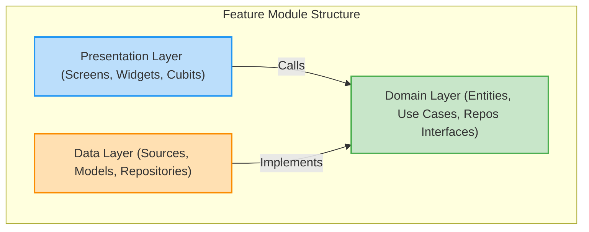

# Folder Structure Overview

This document presents a high-level overview of **Sha8lny's** project structure, detailing its implementation of Uncle Bob's **Clean Architecture** organized with a **Feature-First** approach.

---

## 📁 Architectural Layout

The application separates concerns by dividing the codebase into two primary directories: `core` (shared resources) and `features` (independent functional modules).

```text
lib/
├── core/                       # Shared platform and application components
│   ├── config/                 # Global provider and service configurations
│   ├── constants/              # Global constants and Database table/column schemas
│   ├── cubit/                  # Global BLoCs/Cubits (Theme, Language, Connectivity)
│   ├── errors/                 # Exception and Failure declarations
│   ├── extensions/             # Dart extension helpers
│   ├── models/                 # Shared data models (e.g., OpportunityModel)
│   ├── network/                # HTTP clients, Dio configurations, and interceptors
│   ├── routing/                # Navigation routing and navigation key declarations
│   ├── services/               # Infrastructure services and Main Service Locator
│   ├── theme/                  # Typography styles and color palettes
│   ├── utils/                  # Utilities (validators, local preferences)
│   └── widgets/                # Reusable UI widgets (buttons, loaders, fields)
│
├── features/                   # Self-contained domain feature modules
│   ├── apply_form/             # Job/Internship Application Form
│   ├── auth/                   # Dual-Auth (Firebase / Supabase) login & sign-up
│   ├── chat/                   # Real-time WebSocket Messaging & User Search
│   ├── company/                # Company Profile and Post Management
│   ├── home/                   # Dashboards and General Feeds
│   ├── notifications/          # In-app and Push Notification History
│   ├── onboarding/             # Intro walkthrough carousels
│   ├── opportunities/          # Job postings, reviews, and categories
│   ├── profile/                # Profiles, Resumes, and Digital Wallet
│   ├── progress/               # Project completions and task trackings
│   ├── save_opportunities/     # Bookmarked jobs and listings
│   └── setting/                # Settings, language selectors, help guides
│
├── app.dart                    # Application shell widget
├── app_bloc_observer.dart      # Global BLoC life-cycle logger
└── main.dart                   # Application bootstrap entry point
```

---

## 🧩 Clean Architecture Layers

Each feature directory within `lib/features/` is split into three distinct layers to maintain separation of concerns and prevent tight coupling.



### 1. The Domain Layer (Core Business Logic)
The Domain layer is the heart of the feature. It contains **no external dependencies** or framework imports (such as Flutter or Supabase). This ensures that business logic remains unchanged even if the database SDK, routing engine, or UI components are completely replaced.
- **Entities**: Simple, immutable Dart classes defining the core data shapes.
- **Use Cases**: Individual classes containing a single action or business rules (e.g., `ApplyToOpportunityUseCase`).
- **Repository Interfaces**: Abstract definitions specifying data operations. The domain does not know *how* data is fetched; it only dictates *what* data is needed.

### 2. The Data Layer (Data Retrival & Mapping)
The Data layer is responsible for retrieving and formatting raw data from external APIs, local databases, or memory caches.
- **Data Sources**: Interacts directly with database SDKs (`SupabaseClient`, `FirebaseAuth`, `FirebaseFirestore`) or local stores.
- **Models**: Extends domain entities and includes serialization boilerplate (`fromJson` and `toJson`).
- **Repository Implementations**: Realizes the abstract interfaces defined in the Domain layer. It orchestrates local caching, manages data sources, and maps data models into domain entities.

### 3. The Presentation Layer (User Interface & State)
The Presentation layer is responsible for rendering the UI and handling user interactions.
- **Screens**: Main pages in the navigation tree (e.g., `LoginScreen`).
- **Widgets**: Reusable, modular UI components scoped to the specific feature.
- **Cubits / BLoCs**: Intermediary objects that listen to UI actions, invoke use cases, manage state transitions, and emit reactive states to rebuild UI widgets.
