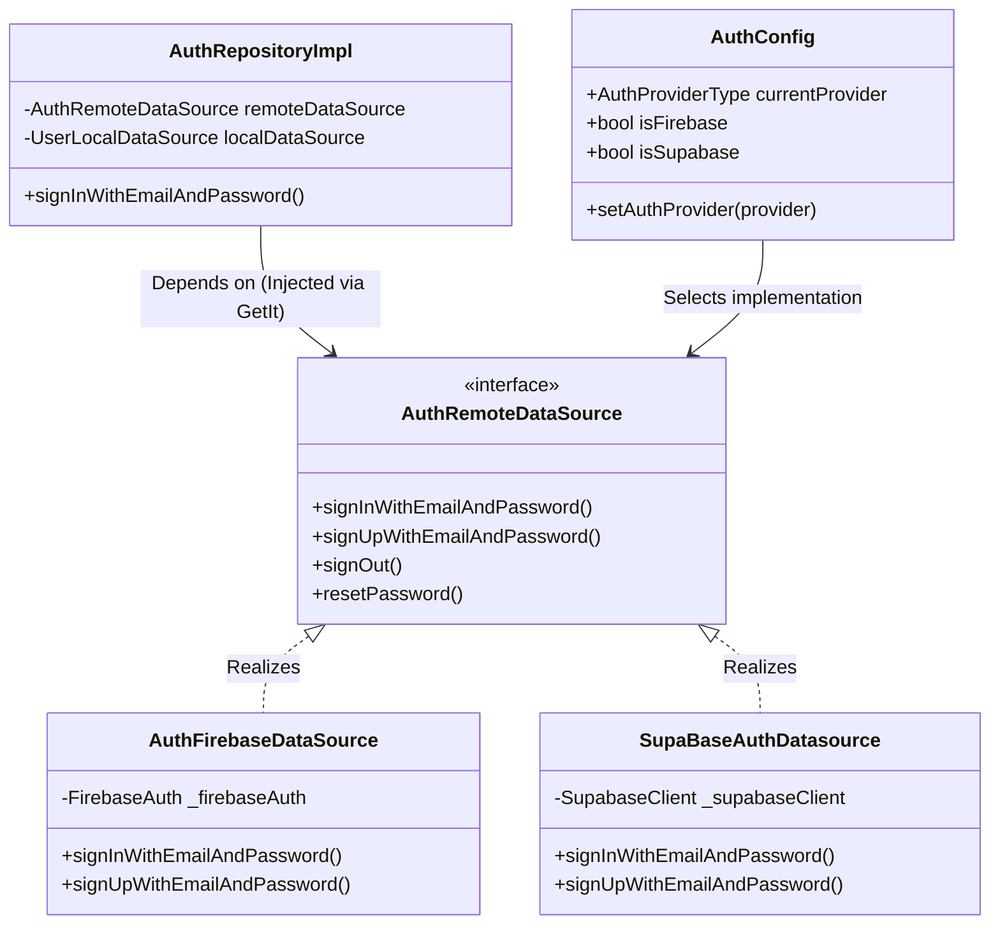

# System Architecture

This document provides a technical overview of **Sha8lny's** system architecture, highlighting the design patterns, data synchronization mechanisms, and structural layers that support the application.

---

## 🏛️ High-Level System Topology

Sha8lny is engineered with a decoupled client-server architecture. The frontend application is built using **Flutter** and communicates asynchronously with cloud backend services via secure REST APIs and WebSockets.

```mermaid
graph TD
    classDef client fill:#e1f5fe,stroke:#01579b,stroke-width:2px;
    classDef svc fill:#efebe9,stroke:#4e342e,stroke-width:2px;
    classDef db fill:#e8f5e9,stroke:#1b5e20,stroke-width:2px;

    %% Client App
    subgraph Client ["Flutter Client App (Clean Architecture)"]
        UI["Presentation Layer (UI & BLoC/Cubit)"]:::client
        UC["Domain Layer (Usecases & Entities)"]:::client
        Repo["Data Layer (Repositories & Models)"]:::client
    end

    %% Backend Services
    subgraph Backend ["Backend & Cloud Infrastructure"]
        SupaClient["Supabase API Gateway"]:::svc
        FireAuth["Firebase Auth Service"]:::svc
        FCM["Firebase Cloud Messaging (FCM)"]:::svc
        
        %% Databases & Storage
        Postgres[("Supabase PostgreSQL DB")]:::db
        SupaStorage[("Supabase Storage buckets")]:::db
        Firestore[("Cloud Firestore DB")]:::db
    end

    %% Connections
    UI --> UC
    UC --> Repo
    
    %% Data Flow
    Repo -->|HTTPS / REST| SupaClient
    Repo -->|WebSockets (Realtime Streams)| SupaClient
    Repo -->|HTTPS| FireAuth
    Repo -->|Push Notifications| FCM
    
    SupaClient --> Postgres
    SupaClient --> SupaStorage
    FireAuth --> Firestore
```

The system uses a **dual-cloud strategy**:
1. **Supabase**: Serves as the primary operational database (Postgres), file storage manager (for resumes, avatars, and attachments), and provider for real-time WebSocket communication (chat streams).
2. **Firebase**: Serves as the push notification broker (Firebase Cloud Messaging) and is available as a toggleable authentication/data backup provider.

---

## 🔑 Dual-Authentication Engine

One of the application's core architectural highlights is its **Dual-Authentication Abstraction**. Rather than hardcoding the authentication system to a single provider (such as Firebase or Supabase), the app employs the **Dependency Inversion Principle (DIP)**.

By declaring abstract interfaces for data retrieval and session management, the application allows developers to switch between authentication backends at compile-time or runtime by changing a single configuration key, without modifying the UI or business logic.



### Abstraction Mechanics
- **Interface Segregation**: The `AuthRemoteDataSource` and `UserRemoteDataSource` contracts are defined in the Domain/Data boundary.
- **Service Locator Resolution**: During application initialization, the dependency injection container (`GetIt`) evaluates the `AuthConfig.currentProvider` and binds the corresponding implementation.
- **Zero UI-coupling**: Features like the Login or Sign-Up screens interact solely with the `AuthCubit`, which dispatches commands to use cases without exposure to Supabase or Firebase libraries.

---

## 🔄 Data Flow & Real-Time Synchronization

For real-time experiences—such as messaging, live user status, and application status checks—the application leverages **reactive programming streams**.

Instead of polling the backend database periodically, the app opens a persistent WebSocket connection to Supabase's Realtime Engine.

### Reactive Message Flow Example:
1. **Subscription**: The presentation layer (via `ChatCubit`) asks for a stream of messages for a specific chat room.
2. **Data Mapping**: The remote data source maps the raw PostgreSQL real-time stream into a Dart `Stream<List<MessageModel>>`.
3. **State Mutation**: The repository filters and processes notifications, returning entities to the presentation layer.
4. **UI Update**: A Flutter `StreamBuilder` or a Bloc listener reacts to incoming events, animating the screen layout to display the new message immediately.

```
[Supabase Postgres] -> (WS Broadcast) -> [Supabase Realtime SDK] -> [ChatRemoteDataSource] -> [ChatRepository] -> [ChatCubit] -> [UI View]
```

---

## 🛠️ State Management & Dependency Injection Flow

State management is built on **BLoC/Cubit** (`flutter_bloc`), ensuring strict separation between UI presentation, state emissions, and business logic.

### Dependency Injection Pipeline
The application uses **GetIt** as a Service Locator to manage dependencies in a thread-safe, memory-efficient manner.
1. **External Client Registrations**: Third-party SDK clients (`FirebaseAuth`, `FirebaseFirestore`, `SupabaseClient`) are registered as lazy singletons.
2. **Data Layer Registrations**: Local and remote data sources are registered.
3. **Repository Registrations**: Implementations are registered, taking data sources as constructor parameters.
4. **Domain Use Cases**: Interactors are registered, taking repository interfaces as arguments.
5. **Presentation Cubits**: Instantiated on demand as Factories to ensure state cleanups when widgets dispose.
