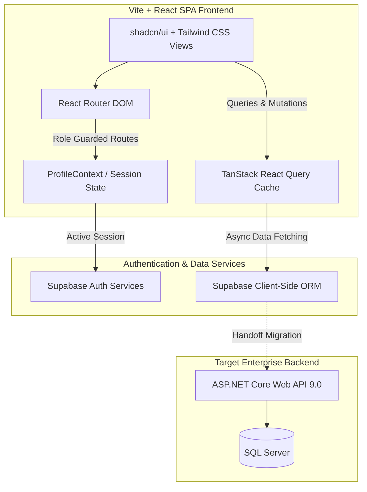

# 💼 Sha8alny B2B Portal: Company & Admin Dashboard

Welcome to the public showcase repository for the **Sha8alny B2B Portal** (B2B Admin Panel & Employer Dashboard). 

**Sha8alny** (Arabic for *"Employ Me"* / *"Give Me Work"*) is a specialized student freelancing, internship, and training platform. It connects university students looking for real-world project experience with companies seeking top academic talent. 

This repository serves as a **Showcase Repository** for the React-based frontend of the B2B portal. It has been stripped of proprietary business logic, API secrets, and source code, focusing entirely on **architecture design**, **state management**, **Role-Based Access Control (RBAC)**, and **UI/UX excellence**.

---

## 🏗️ High-Level System Architecture

The B2B Portal is a single-page application (SPA) built on Vite, React, and TypeScript. In its current version, the frontend connects client-side to a cloud-based Supabase database and authentication service. A migration path is also designed to shift this to a custom .NET 9.0 Web API and Microsoft SQL Server backend for corporate scaling.



---

## 🔑 Key Architectural Highlights

*   **Role-Based Access Control (RBAC)**: Secure routing separating `admin` and `company` portals, with custom React Router guards (`RequireAdminAuth` and `RequireProfileCompletion`).
*   **Declarative State Caching**: Leveraging TanStack React Query for automated caching, background revalidation, loading skeletons, and transactional UI state sync.
*   **Modular Layouts**: Sidebars and headers that dynamically adapt styling, options, and actions based on the logged-in user's role and database profile.
*   **Shadcn/UI & Tailwind Visuals**: Premium, dark-mode-ready, accessible design patterns built using Radix UI primitives and micro-animations.

---

## 📂 Deep-Dive Documentation Index

To explore the frontend implementation details, navigate through the following sub-documents:

*   📖 **[Architecture & State Management](docs/architecture_state_management.md)**
    *Detailing the application's React SPA architecture, routing, and context-based state synchronization.*
*   📖 **[Role-Based Access Control (RBAC)](docs/rbac.md)**
    *Explaining how the platform distinguishes between Admin and Company profiles, guards routes, and validates registration states.*
*   📖 **[Core Dashboards & Features](docs/core_modules.md)**
    *An exhaustive breakdown of the Admin Control Panel, Company Opportunity Dashboard, and Applicant Tracking System.*
*   📖 **[API Integration Strategy](docs/api_integration.md)**
    *Analyzing our client-side database calling model, TanStack queries/mutations, and the migration strategy to a .NET API.*
*   📖 **[Tech Stack & UI Libraries](docs/tech_stack.md)**
    *A catalog of the frontend frameworks, component libraries, form systems, and charting configurations.*
*   📖 **[Folder Structure Blueprint](docs/folder_structure.md)**
    *A textual file tree of the React application's codebase to demonstrate modular design and clean code practices.*

---

## 🚀 local Development Showcase Setup

This section describes how the original code is structured to run locally for development and preview:

### Prerequisites
*   **Node.js**: `v18.x` or higher
*   **Bun** or **NPM**: Package manager

### Installation
Clone the repository (or extract the bundle) and install the dependencies:
```bash
# Install dependencies using bun (or npm install)
bun install
```

### Running the Dev Server
Launch Vite's hot-reloading development server:
```bash
bun run dev
```
The application will launch on `http://localhost:5173`.

### Production Build
To bundle the React code for production hosting:
```bash
bun run build
```
The static assets will be compiled into the `dist/` directory, optimized and minified.
